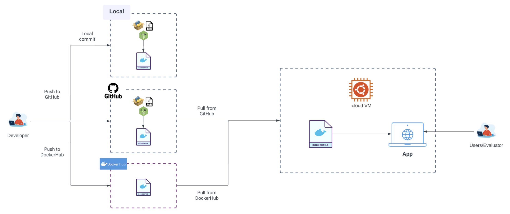

# Containerizing Applications

This project features a straightforward React application that has been containerized. The container is hosted on Docker Hub.

Additionally, the project includes Ansible scripts designed to facilitate the creation of essential AWS infrastructure components. These scripts automate the setup of a VPC, public subnet, IGW (Internet Gateway), route table, security group, and an EC2 instance within your AWS account. The EC2 instance is initiated by pulling the containerized React application image from Docker and running it on port 3000.

Explore the Docker Hub repository for the containerized React application [here](https://hub.docker.com/r/laratunc/my-app).

# Instructions

Follow these steps to set up and run the project:

1. **Navigate to the "ansible" directory**

```sh
cd ansible
```

2.  **Install Ansible**

    Ensure Ansible is installed on your system. If not, you can follow the official [Ansible Installation Guide](https://docs.ansible.com/ansible/latest/installation_guide/intro_installation.html).

3.  **Execute the Ansible playbook**
    Create essential AWS infrastructure components, including a VPC, public subnet, IGW, route table, security group, and an EC2 instance in your AWS profile. Ensure Ansible is installed before running this command.

```sh
ansible-playbook setup.yml
```

4. **Retrieve the Public IPv4 address of EC2**
   The instance should be named my_ec2.

5. **Run on Browser**
   Open your web browser and enter the following URL, replacing <public-ipv4-address-of-your-instance> with the actual Public IPv4 address of your EC2 instance:
   `http://<public-ipv4-address-of-your-instance>:3000`

6. **Voila 🎉**
   You should see a simple React application with the message Lara's React App.


7. **Destroy**
   To tear down the provisioned resources, run the following Ansible playbook (destroy.yml). Make sure to replace the resource IDs with your own:

```sh
ansible-playbook destroy.yml
```

# Architecture



# Running the React App Locally

```sh
$ yarn
$ yarn start
```

## Additional Resources

- [GitHub Repository](https://github.com/LaraTunc/wcd-3-docker)
- [Docker Hub Repository](https://hub.docker.com/r/laratunc/my-app)
- [Docs Used](#)
  - [Ansible Documentation](https://docs.ansible.com/ansible/latest/index.html)
  - [Docker Documentation](https://docs.docker.com/get-started/)
  - [Docker Multi-platform Images](https://docs.docker.com/build/building/multi-platform/)
  - [Docker on EC2](https://www.workfall.com/learning/blog/how-to-install-and-run-docker-containers-on-amazon-ec2-instance/)

This project was bootstrapped with [Create React App](https://github.com/facebook/create-react-app).
